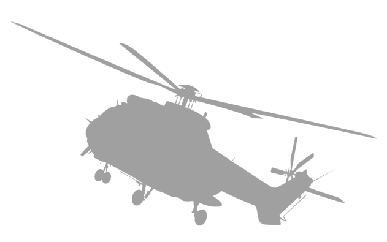
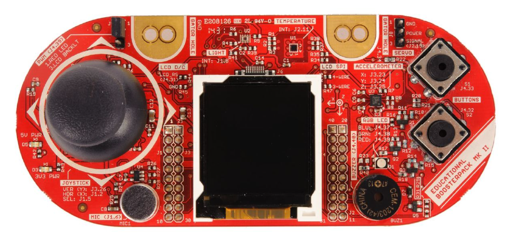

<!-- Improved compatibility of back to top link: See: https://github.com/othneildrew/Best-README-Template/pull/73 -->
<a name="readme-top"></a>
<!--
*** Thanks for checking out the Best-README-Template. If you have a suggestion
*** that would make this better, please fork the repo and create a pull request
*** or simply open an issue with the tag "enhancement".
*** Don't forget to give the project a star!
*** Thanks again! Now go create something AMAZING! :D
-->


<!-- PROJECT SHIELDS -->
<!--
*** I'm using markdown "reference style" links for readability.
*** Reference links are enclosed in brackets [ ] instead of parentheses ( ).
*** See the bottom of this document for the declaration of the reference variables
*** for contributors-url, forks-url, etc. This is an optional, concise syntax you may use.
*** https://www.markdownguide.org/basic-syntax/#reference-style-links
-->
[![Contributors][contributors-shield]][contributors-url]


<!-- PROJECT LOGO -->
<br />
<div align="center">
  <a href="https://github.com/github_username/repo_name">
    
  </a>

<h3 align="center">HELICOPTER CONTROLLER</h3>

  <p align="center">
    Implementation of a controller for the infrared helicopter Syma S107n
    <br />
    <br /><br />
  </p>
</div>


<!-- TABLE OF CONTENTS -->
<details>
  <summary>Table of Contents</summary>
  <ol>
    <li>
      <a href="#about-the-project">About The Project</a>
    </li>
    <li><a href="#built-with">Built With</a></li>
    <li>
      <a href="#installation">Installation</a>
    </li>
    <li><a href="#requirements">Requirements</a></li>
    <li><a href="#folder-structure">Folder Structure</a></li>
    <li><a href="#using-the-code">Using the code</a></li>
    <li><a href="#roadmap">Roadmap</a></li>
    <li><a href="#contact">Contact</a></li>
  </ol>
</details>
<br>


<!-- ABOUT THE PROJECT -->
## About The Project

This project is an infrared remote controller for the Texas Instruments MSP432P401R microcontroller. It allows the MSP432P401R (together with the [Educational BoosterPack MKII](https://www.ti.com/tool/BOOSTXL-EDUMKII))  to send infrared signals to control the infrared helicopter Syma S107n.


<p align="right">(<a href="#readme-top">back to top</a>)</p>


## Built With

[![Next][c]][c-url]

<p align="right">(<a href="#readme-top">back to top</a>)</p>


### Installation


 Clone the repo
   ```sh
   git clone git@github.com:damianobertolini/msp432_IR_Controller.git
   ```


<p align="right">(<a href="#readme-top">back to top</a>)</p>

# Requirements

## Software requirements

To use this project, you will need the following software:

* MSP432-specific version of the [MSPWare software](https://www.ti.com/tool/MSP432WARE#downloads)
* [Code Omposer Studio](https://www.ti.com/tool/CCSTUDIO) Integrated Development Environment (IDE)
* Software developement kit for MSP432: [SIMPLELINK-MSP432-SDK](https://www.ti.com/tool/download/SIMPLELINK-MSP432-SDK/3.40.01.02)
<br> <br>

## Hardware Requirements
To use this project, you will need the following hardware:

* Texas Instruments MSP432P401R microcontroller
* [Educational BoosterPack MKII](https://www.ti.com/tool/BOOSTXL-EDUMKII)
* Infrared sensor
* Current-limiting resistor
* Jumper wires
* HC08 Bluetooth module



<br> <br>


## Setting up the hardware
infrarosso: gnd P2.5
bluetooth gnd 3.3v 3.2 3.3
Connect the various components as follows:
* Connect the BoosterPack MKII to the MSP432P401R Launchpad.
* Connect the cathode of the LED (in series with the transistor) to a ground pin on the MSP432.
* Connect the anode of the LED (in series with the transistor) to the P2.5 pin on the MSP432.
* Connect the bluetooth module wires to the 3.3V, 3.2V, 3.3V, GND.
<br> <br>
<!-- USAGE EXAMPLES -->
# Folder Structure

## Directory layout


    .
    ├── Debug                  # Compiled files 
    ├── Hardware               # Hardware related files
    │   ├── Bluetooth
    │   ├── Clock
    │   ├── Graphics
    │   ├── Infrared
    │   └── Lcd
    ├── Logic                  # Control logic
    │   └── Interrupts
    ├── Release                    
    ├── targetConfigs          # Target configuration files
    ├── main.c                 # Main source code
    └── README.md


<!-- USING THE CODE -->
## Using the code

1. Open the project in Code Composer Studio.
2. Got to: _Project -> Properties -> Build -> Arm Compiler -> Include Options_ and add the _source_ directory located in _simplelink_msp432p4_sdk_3_40_01_02/_
3. Got to: _Project -> Properties -> Build -> Arm Linker -> File Search Path_ and add:
    * _msp432p4xx_dreivelib.lib_ directory_ located in _[..]/source/ti/devices/msp432p4xx/driverlib/ccs/_
    * _grlib.a_ located in _[..]/source/ti/grlib/lib/ccs/m4f/_
6. Build and run the project. The Launchpad should now be displaying the graphics.

_For more examples, please refer to the [Documentation](https://docs.rs-online.com/3934/A700000006811369.pdf)_
<p align="right">(<a href="#readme-top">back to top</a>)</p>


<!-- ROADMAP -->
## Roadmap

- [ ] Feature 1
- [ ] Feature 2
- [ ] Feature 3
    - [ ] Nested Feature

See the [open issues](https://github.com/github_username/repo_name/issues) for a full list of proposed features (and known issues).

<p align="right">(<a href="#readme-top">back to top</a>)</p>


<!-- CONTACT -->
## Contact

Damiano Bertolini - damybert@gmail.com <br>
Matteo Beltrami - beltramimatteo01@gmail.com <br>
Rowan Alessandro Bevilacqua - rowan.bevilacqua@studenti.unitn.it

Project Link: [https://github.com/damianobertolini/msp432_IR_Controller](https://github.com/damianobertolini/msp432_IR_Controller)

<p align="right">(<a href="#readme-top">back to top</a>)</p>


<!-- MARKDOWN LINKS & IMAGES -->
<!-- https://www.markdownguide.org/basic-syntax/#reference-style-links -->
[contributors-shield]: https://img.shields.io/github/contributors/damianobertolini/msp432_IR_Controller.svg?style=for-the-badge
[contributors-url]: https://github.com/github_username/repo_name/graphs/contributors
[forks-shield]: https://img.shields.io/github/forks/github_username/repo_name.svg?style=for-the-badge
[forks-url]: https://github.com/github_username/repo_name/network/members
[stars-shield]: https://img.shields.io/github/stars/github_username/repo_name.svg?style=for-the-badge
[stars-url]: https://github.com/github_username/repo_name/stargazers
[issues-shield]: https://img.shields.io/github/issues/github_username/repo_name.svg?style=for-the-badge
[issues-url]: https://github.com/github_username/repo_name/issues
[license-shield]: https://img.shields.io/github/license/github_username/repo_name.svg?style=for-the-badge
[license-url]: https://github.com/github_username/repo_name/blob/master/LICENSE.txt
[linkedin-shield]: https://img.shields.io/badge/-LinkedIn-black.svg?style=for-the-badge&logo=linkedin&colorB=555
[linkedin-url]: https://linkedin.com/in/linkedin_username
[product-screenshot]: images/screenshot.png
[c]: https://img.shields.io/badge/c-%2300599C.svg?style=for-the-badge&logo=c&logoColor=white
[c-url]: https://www.gnu.org/software/gnu-c-manual/gnu-c-manual.html

