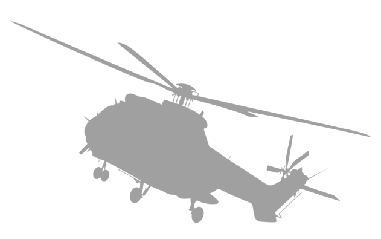
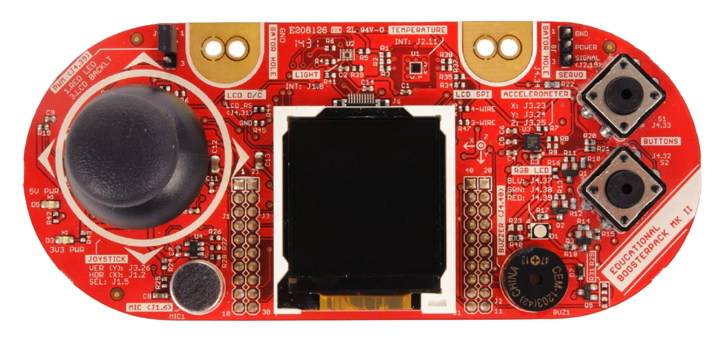

<!-- Credits for the readme template: https://github.com/othneildrew/Best-README-Template/ -->
<a name="readme-top"></a>

<!--[![Contributors][contributors-shield]][contributors-url] >


<!-- PROJECT LOGO -->
<br />
<div align="center">
  <a href="https://github.com/damianobertolini/msp432_IR_Controller">
    
  </a>

<h3 align="center">HELICOPTER CONTROLLER</h3>

  <p align="center">
    Implementation of a controller for the infrared helicopter Syma S107n using MSP432
    <br />
    <br /><br />
  </p>
</div>


<!-- TABLE OF CONTENTS -->
<details>
  <summary>Table of Contents</summary>
  <ol>
    <li><a href="#about-the-project">About The Project</a></li>
    <li><a href="#built-with">Built With</a></li>
    <li><a href="#installation">Installation</a></li>
    <li><a href="#requirements">Requirements</a></li>
    <li><a href="#folder-structure">Folder Structure</a></li>
    <li><a href="#functionalities-explanation">Functionalities explanation</a></li>
    <li><a href="#getting-started">Getting started</a></li>
    <li><a href="#video-and-presentation">Video and Presentation</a></li>
    <li><a href="#team-members">Team members</a></li>
    <li><a href="#contact">Contact</a></li>
  </ol>
</details>
<br>


<!-- ABOUT THE PROJECT -->
## About The Project

This project simulates an infrared remote controller using the Texas Instruments MSP432P401R microcontroller. <br>
It allows the MSP432P401R (along with the [Educational BoosterPack MKII](https://www.ti.com/tool/BOOSTXL-EDUMKII))  to send infrared signals in order to control the helicopter Syma S107n. <br>

<br>

## Built With

[![c]][c-url]


### Installation


 Clone the repo (or fork it)
   ```sh
   git clone git@github.com:damianobertolini/msp432_IR_Controller.git
   ```


<p align="right">(<a href="#readme-top">back to top</a>)</p>

# Requirements

## Software requirements

To use this project, you will need the following software:

* MSP432-specific version of the [MSPWare software](https://www.ti.com/tool/MSP432WARE#downloads)
* [Code Composer Studio](https://www.ti.com/tool/CCSTUDIO) Integrated Development Environment (IDE)
* Software developement kit for MSP432: [SIMPLELINK-MSP432-SDK](https://www.ti.com/tool/download/SIMPLELINK-MSP432-SDK/3.40.01.02)
<br> <br>

## Hardware Requirements
To use this project, you will need the following hardware:

* Texas Instruments MSP432P401R microcontroller
* [Educational BoosterPack MKII](https://www.ti.com/tool/BOOSTXL-EDUMKII)
* Infrared emitter sensor
* Current-limiting resistor (the best one is a 50 Ohm Resistance)
* Jumper wires
* HC08 Bluetooth module (you can also use the Bluetooth Module you prefer)


<p float="left">
  
  
</p>

<br> <br>


## Setting up the hardware
Connect the various components as follows:
* Connect the BoosterPack MKII to the MSP432P401R Launchpad.
* Connect the cathode of the LED (in series with the transistor) to a GND pin on the MSP432.
* Connect the anode of the LED (in series with the transistor) to the PIN 2.5 on the MSP432.
* Connect the Bluetooth module wires to the GND and 3.3V for power and to PIN 3.2 and PIN 3.3 for data transmitting and receiving.
<br> <br>

<p align="right">(<a href="#readme-top">back to top</a>)</p>

<!-- USAGE EXAMPLES -->

## Folder structure
    MSP432_Project
    ├── Debug                  # Compiled files 
    ├── Hardware               # Hardware related files
    │   ├── Bluetooth          # Manages Bluetooth connection
    │   ├── Clock              # Manages System Master Clock (48MHz)
    │   ├── Graphics           # Manages all the graphics required
    │   ├── Infrared           # Sends IR signals using PWM on PIN 2.5
    │   └── Lcd                # Manages the LCD setup
    ├── Logic                  # Control logic and program testing
    │   └── Interrupts         # Contains all the interrupts required
    ├── Release
    ├── Images                 # Images for the README
    ├── targetConfigs          # Target configuration files
    ├── main.c                 # Main source code
    └── README.md

<br>

<!-- FUNCTIONALITIES EXPLANATION -->
## Functionalities explanation

The microcontroller shows at startup an helicopter with moving propellers, then the main menu is displayed, which contains as options:  <br>
* Joystick
* Accelerometer
* Bluetooth

Each of these options, when selected, enables the use of the selected peripheral in order to drive the helicopter; the available options are:  <br>
 1. Move forward
 2. Move backward
 3. Turn right
 4. Turn left
 5. Increment power (using the upper button on Boosterpack MKII)
 6. Decrement power (using the lower button on Boosterpack MKII)

 The Bluetooth option also provides a "landing" function which just smoothly decrements the power intensity of the propellers until the helicopter stops.

 In order to setup the Bluetooth Connection, you need a BLE-Compatible device with Position and Bluetooth enabled, and an app for BLE Scanning and signal sending (you can choose the one you prefer, for example BLE Terminal available on Google Play). After connecting, launch the program on MSP432 and you will receive some messages which indicate that the connection is established and working. 

 <p align="right">(<a href="#readme-top">back to top</a>)</p>

<!-- GETTING STARTED -->
## Getting started

1. Open the project in Code Composer Studio.
2. Go to: _Project → Properties → Build → Arm Compiler → Include Options_ and add the _source_ directory located in _simplelink_msp432p4_sdk_3_40_01_02/_
3. Go to: _Project → Properties → Build → Arm Linker → File Search Path_ and add:
    * _msp432p4xx_dreivelib.lib_ directory_ located in _[..]/source/ti/devices/msp432p4xx/driverlib/ccs/_
    * _grlib.a_ located in _[..]/source/ti/grlib/lib/ccs/m4f/_
6. Build and run the project. The Launchpad should now be displaying the graphics.

_For more examples, please refer to the [Documentation](https://docs.rs-online.com/3934/A700000006811369.pdf)_

<br>


<!-- VIDEO AND PRESENTATION -->
## Video and Presentation

- Youtube [video](https://youtu.be/hcxit87viYA)
- Presentation [slides](https://docs.google.com/presentation/d/1sG-96dGQjHRR0gdiXGEs0CYU5uLZg5O0sb5HPO7m0KU/edit?usp=sharing)

<p align="right">(<a href="#readme-top">back to top</a>)</p>


<!-- TEAM MEMBERS -->
# Team Members 

The project was a developed in a team and the code was divided into different areas (Logic, Hardware setup, Graphics, ...); each one of the members concentrated therefore on certain aspects of the project.

Damiano Bertolini: <br>
&nbsp; contributed to the implementation of the hardware, control logic, bluetooth and infrared controller to send signals to the IR helicopter and to the testing phase.<br> <br>
Matteo Beltrami: <br>
&nbsp; contributed to the creation of the graphics displayed on the lcd, to the management of the movements to control the IR helicopter and to the testing phase.<br> <br>
Rowan Alessandro Bevilacqua: <br>
&nbsp; contributed to the menu implementation and code review and management.<br> 

<br>

<!-- CONTACT -->
## Contact

Damiano Bertolini - damybert@gmail.com <br>
Matteo Beltrami - beltramimatteo01@gmail.com <br>
Rowan Alessandro Bevilacqua - rowan.bevilacqua@studenti.unitn.it

Project Link: [https://github.com/damianobertolini/msp432_IR_Controller](https://github.com/damianobertolini/msp432_IR_Controller)

<p align="right">(<a href="#readme-top">back to top</a>)</p>


<!-- MARKDOWN LINKS & IMAGES -->
<!-- https://www.markdownguide.org/basic-syntax/#reference-style-links -->

[contributors-shield]: https://img.shields.io/github/contributors/damianobertolini/msp432_IR_Controller.svg?style=for-the-badge
[contributors-url]: https://github.com/damianobertolini/msp432_IR_Controller/graphs/contributors
[c]: https://img.shields.io/badge/c-%2300599C.svg?style=for-the-badge&logo=c&logoColor=white
[c-url]: https://www.gnu.org/software/gnu-c-manual/gnu-c-manual.html
